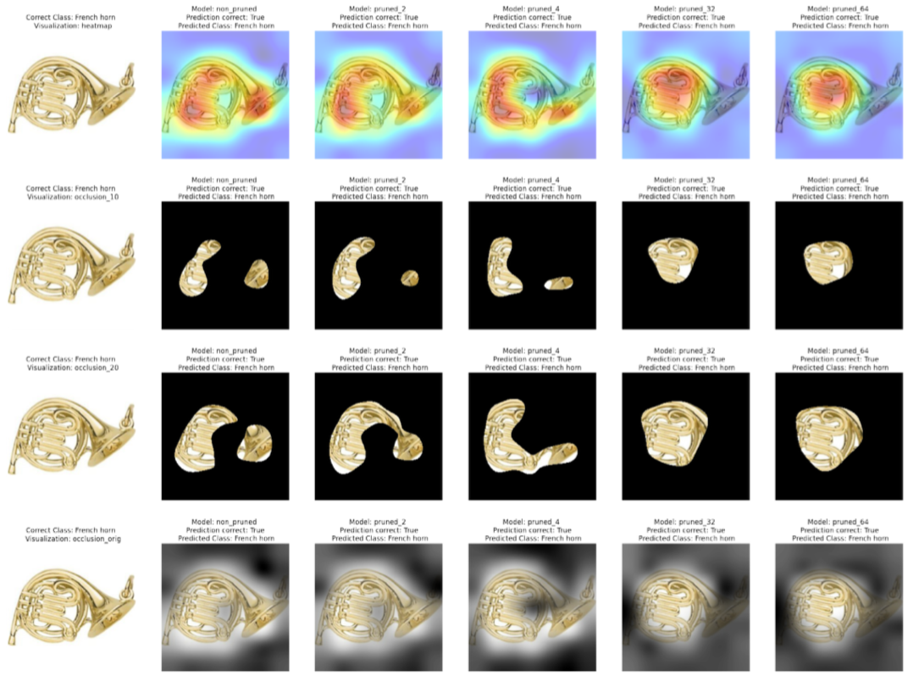
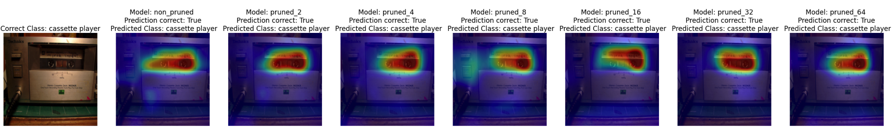

# masterthesis-showcase
Repo to show results of my thesis experiments: The influence of pruning on gradient-based attribution methods

## GradCAM: Introduction
Grad-CAM is a popular technique for visualizing where a convolutional neural network model is looking. It is applied to a neural network that converged. The weights of the neural network are fixed. We feed an image into the network to calculate the Grad-CAM heatmap for that image for a chosen class of interest. The output of GradCAM is a “class-discriminative localization map”, i.e. a heatmap where the hot part corresponds to a particular class. In my case, I always choose the predicted class as the one of interest. Should the prediction be wrong, GradCAM heatmaps can help to find out why the model is wrong (i.e. that it looked at a different part in the image).

When applying GradCAM to a VGG-16 I trained from scratch (not using the pre-trained version on Imagenet), I recognized that its heatmaps are fairly different, than applying GradCAM to a pre-trained VGG-16 (which was later finetuned on Imagenette). Therefore, the first notebook below shows GradCAM heatmaps on a trained VGG from scratch, the second notebook shows GradCAM heatmaps for a VGG that was trained on Imagenet already.

## Results
NB-Viewer: https://nbviewer.jupyter.org/github/weberdavid/masterthesis-showcase/blob/main/ExperimentResults.ipynb
Includes:
- Results Experiment 1 - Class-Specific Image Parts
- Results Experiment 1 - Grad-CAM Heat-Maps
- Results Experiment 2 - What is on the Picture?

## Pretrained VGG-16: Heatmaps & Occlusion Maps
NB-Viewer: https://nbviewer.jupyter.org/github/weberdavid/masterthesis-showcase/blob/aabfa37918c289fd4c2e48a3cc19011651b56568/ExperimentBasis_01.ipynb
Includes:
- Training Details
- Pruning Results (local magnitude unstructured, LRU not done yet)
- Pruning Compression Rates (2, 4, 8, 16, 32, 64)
- Different GradCAM Visualization Techniques

Visualizations are divided in 4 rows with each 6 images:
- every row shows the original image, a map for the non-pruned model, 2-compression, 4-compression, 32-compressio, 64-compression
- the first row, shows the heatmaps of GradCAM as in other notebooks
- the second row shows a black-transparent map, only letting through 10% of the highest pixels of the activation_map - the rest is blacked out
- the third row, similar to the second row, just letting 20% of the highest pixels through
- the fourth row, similar to the first row just with a heatmap reaching from black to transparent.

## VGG-16 finetuned for Imagenette (pretrained on Imagenet)
NB-Viewer: https://nbviewer.jupyter.org/github/weberdavid/masterthesis-showcase/blob/main/pretrainedGrad-CAM-pruning%20comparison.ipynb  
Includes:
- Training Details
- Pruning Results (local magnitude unstructured, LRU not done yet)
- Pruning Compression Rates (2, 4, 8, 16, 32, 64)
- GradCAM Visualizations

This notebook is based on a pre-trained VGG (Imagenet) that was finetuned for Imagenette. Then, all convolutional layers were pruned according to local-magnitude-unstructured pruning iteratively. Every row of GradCAM heatmap-images shows one prediction made by the model - for every pruning compression rate (2 - 64). The french horn images below shows the difference to the later mentioned approach and how heatmaps evolve for different pruning rates.

What we see as well, is that there are fairly many examples that do not show any differences of heatmaps among the compression rates. However, the heatmaps seem *more 'stable'* compared to the later mentioned approach.

## VGG-16 trained from Scratch on Imagenette
NB-Viewer: https://nbviewer.jupyter.org/github/weberdavid/masterthesis-showcase/blob/main/Grad-CAM-pruning%20comparison.ipynb  
Includes:
- Training Details
- Pruning Results (local magnitude unstructured and local random unstructured)
- Pruning Compression Rates (2, 4, 8, 16, 32, 64)
- GradCAM Visualizations

For this notebook, a VGG-16 was randomly initialized and then trained on the Imagenette dataset. The convolutional layer of this trained model were then pruned iteratively with two different pruning methods and finetuned again until convergence.

The first row of images shows the original image, the non-pruned model heatmap and then the VGG-16 pruned heatmaps for every compression rate based on local-magnitude-unstructured pruning. The second row shows the original image, the non-pruned model heatmap (as in first row) and then the VGG-16 pruned heatmaps for every compression rate based on local-random-unstructured pruning as a comparison. It is interesting to see differences of the GradCAM heatmaps among the different model compression rates and pruning methods, as the image-row of the french horn shows below.

